# 🏪 Master POS — Multi-Tenant Point of Sale System

<div align="center">

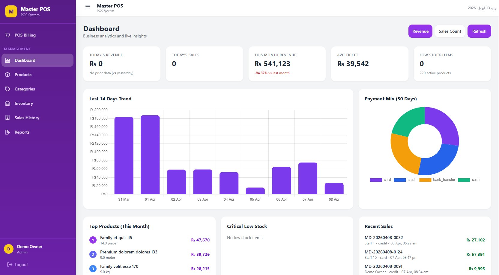

[](https://laravel.com)
[](https://vuejs.org)
[](https://laravel.com/docs/sanctum)
[](LICENSE)

**A full-featured, multi-tenant Point of Sale system built with Laravel + Vue.js**

[🌐 Live Demo](https://demo-master-pos.kitsoftsol.com/) • [⚙️ API Backend](https://demo-backend-master-pos.kitsoftsol.com/) • [📧 Contact](mailto:your@email.com)

> **Demo Credentials:** `demo@masterpos.com` / `demo1234`

</div>

---

## 📋 Table of Contents

- [About The Project](#-about-the-project)
- [Key Features](#-key-features)
- [Tech Stack](#-tech-stack)
- [Screenshots — Web System](#-screenshots--web-system)
- [Screenshots — API (Swagger)](#-screenshots--api-swagger)
- [Architecture](#-architecture)
- [Multi-Tenancy](#-multi-tenancy)
- [API Reference](#-api-reference)
- [Getting Started](#-getting-started)
- [Subscription Plans](#-subscription--plan-limits)
- [Error Handling](#-error-handling)

---

## 🚀 About The Project

**Master POS** is a SaaS-ready, multi-tenant Point of Sale system designed for retail businesses. Each business (tenant) operates in a fully isolated environment with its own products, categories, inventory, staff, and sales data — all managed through a clean Vue.js dashboard and powered by a robust Laravel REST API.

This project demonstrates:
- Multi-tenant SaaS architecture with header-based tenant isolation
- Token-based authentication with Laravel Sanctum
- Role-based access control (Admin / Staff)
- Subscription plan enforcement at the API middleware level
- Real-time inventory tracking and business analytics

---

## ✨ Key Features

| Feature | Description |
|---|---|
| 🧾 **POS Billing Board** | Touch-friendly product grid, cart management, multi-payment support |
| 📦 **Product Management** | CRUD with images, SKU, unit types, pricing, stock alerts |
| 🏷️ **Category Management** | Color-coded categories with images, active/inactive toggle |
| 📊 **Dashboard Analytics** | Revenue KPIs, 14-day trend chart, payment mix donut chart |
| 🔄 **Inventory Control** | Stock tracking with purchase, adjustment, and return entries |
| 🧾 **Sales History** | Full invoice ledger with cashier tracking and date/status filters |
| 📈 **Reports** | Revenue charts, top products, payment method breakdown |
| 👥 **User Management** | Multi-staff with role-based feature access |
| 🔐 **Multi-Tenant SaaS** | Complete tenant isolation via `X-Tenant-Id` header |
| 📱 **Subscription Plans** | Free/Paid tiers with API-enforced product & user limits |

---

## 🛠 Tech Stack

| Layer | Technology |
|---|---|
| **Backend** | Laravel (PHP 8.1+) |
| **Frontend** | Vue.js 3 |
| **Authentication** | Laravel Sanctum (Bearer Tokens) |
| **API Style** | RESTful JSON API |
| **Multi-Tenancy** | Header-based (`X-Tenant-Id`) |
| **Database** | MySQL |
| **Hosting** | LiteSpeed / Hostinger |

---

## 📸 Screenshots — Web System

### Login
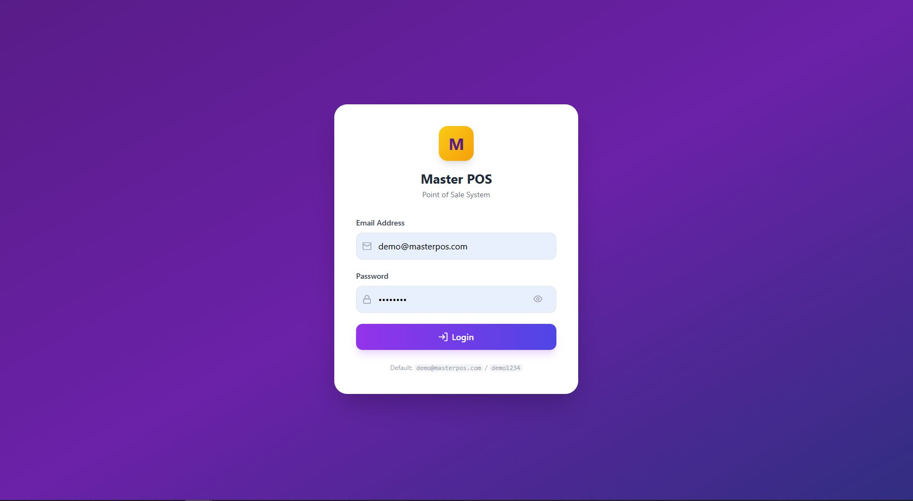

---

### Dashboard
Real-time KPIs, 14-day revenue trend bar chart, payment mix donut chart, top products, low stock alerts, and recent sales feed.


---

### POS Billing Board
Touch-friendly product grid with category filter tabs, cart management, discount input, and payment method selector (Cash / Card / Bank / Credit).


---

### Products
Full product listing with category badge, unit type, price, stock level, and edit/delete actions. Includes search and unit-type filter.

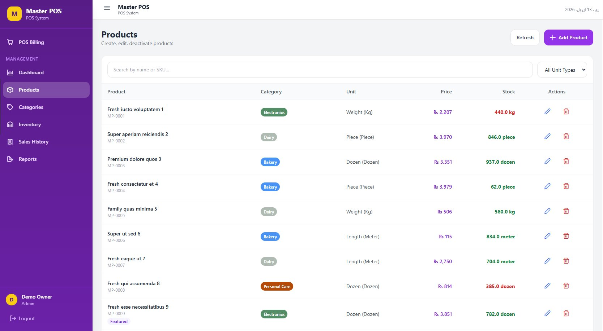

---

### Add Product Form
Modal form with all product fields: name, category, SKU, description, unit type/label, selling price, cost price, opening stock, low stock alert, featured toggle, and image upload.

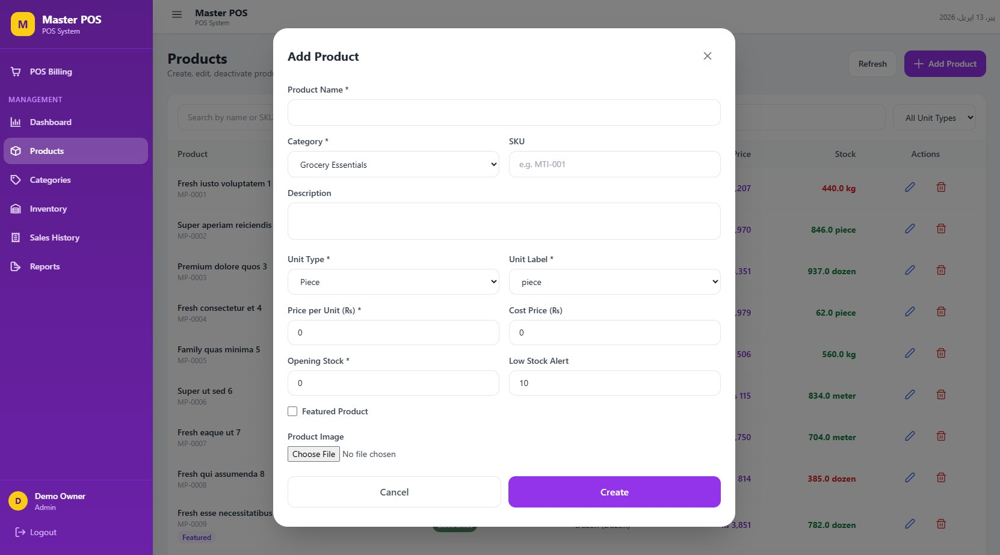

---

### Categories
Color-coded category grid showing product count, slug, active status, and edit/delete controls.

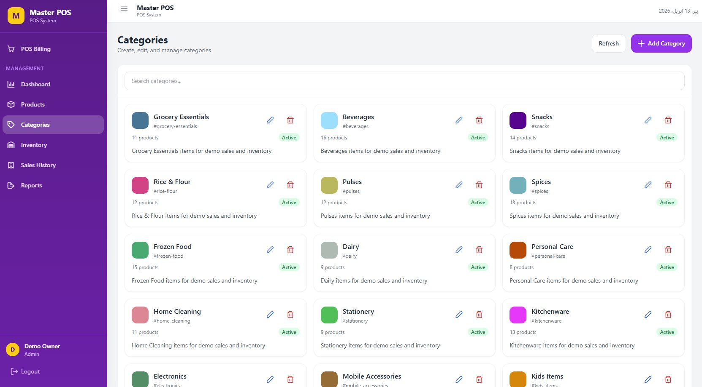

---

### Edit Category
Category edit modal with name, description, color picker, active checkbox, and image upload.

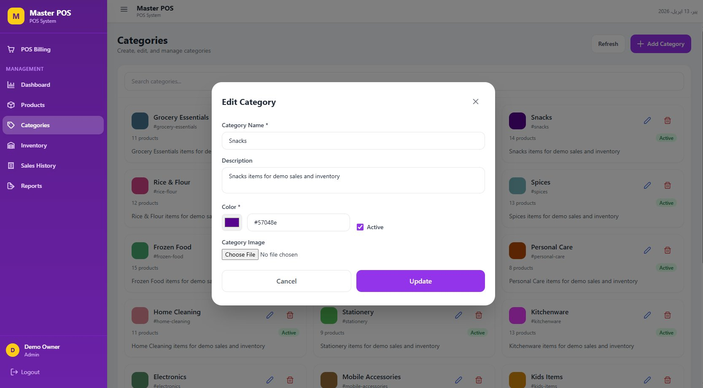

---

### Inventory Management
Live stock list with product name and unit on the left, and a Stock Adjustment panel on the right — supports purchase (+), adjustment, and return types.

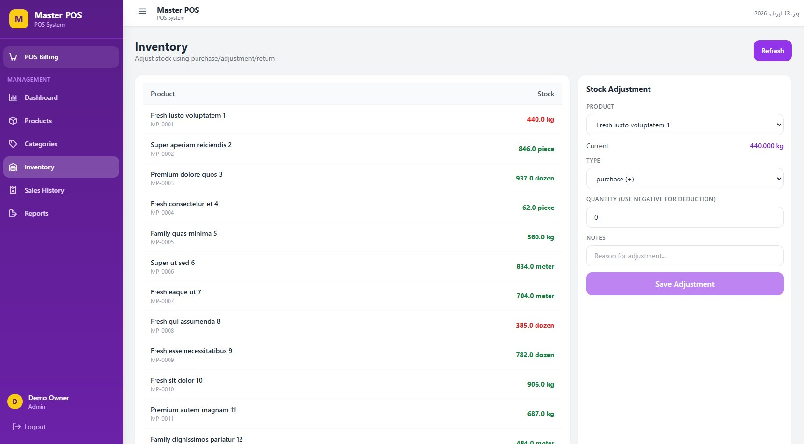

---

### Sales History
Full invoice ledger filterable by date and status. Columns: Invoice number (clickable), Date, Cashier, Items, Total, Status badge, Cancel action.

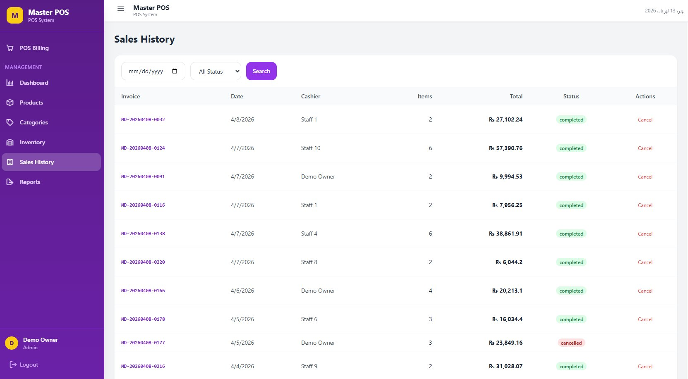

---

### Reports
Revenue summary cards, configurable last-N-days bar chart, payment mix breakdown, and top 5 products by revenue.

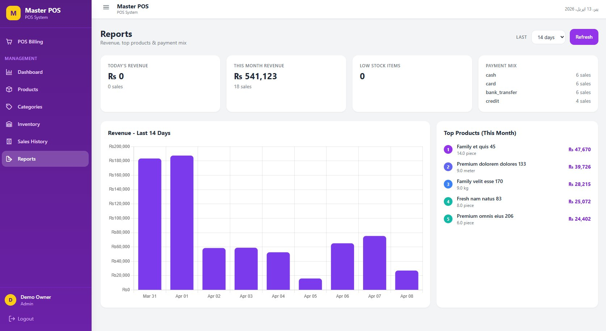

---

## 📡 Screenshots — API (Swagger)

All API endpoints are documented and testable via Swagger UI.

### Login API — Request
`POST /api/auth/login` with `X-Tenant-Id` header and JSON credentials.

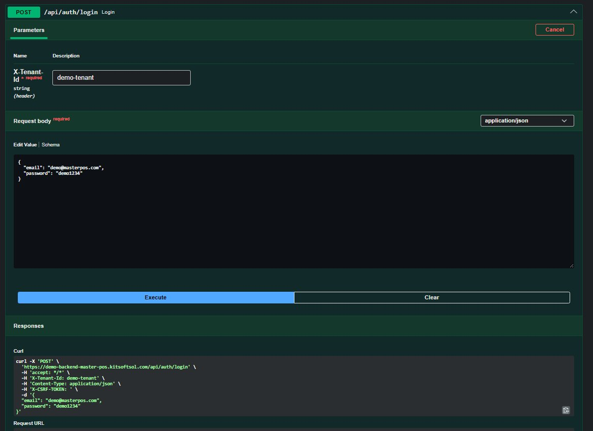

---

### Login API — Response
Returns user object and Bearer token on successful authentication.

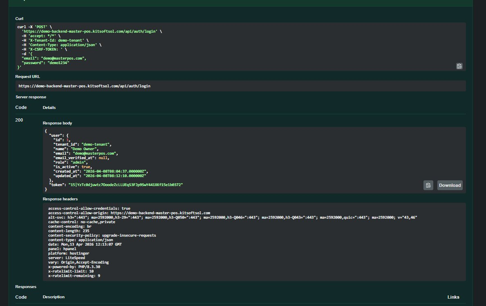

---

### Dashboard Stats API
`GET /api/dashboard/stats` — Returns today/month revenue, growth %, low stock count, avg ticket, and daily chart array.

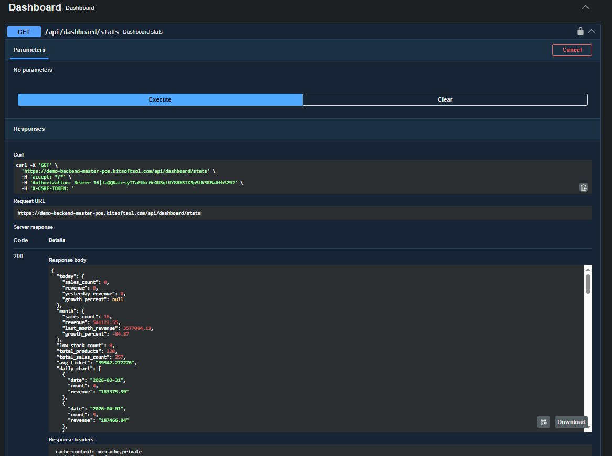

---

### Categories Listing API
`GET /api/categories` — Returns full category list with product counts, slugs, and colors.

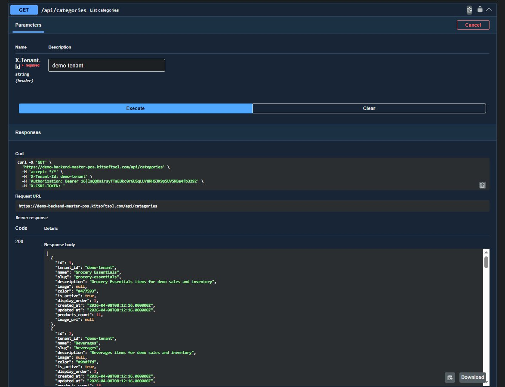

---

### Products Listing API
`GET /api/products` — Returns full product array with pricing, stock, unit info, and metadata.

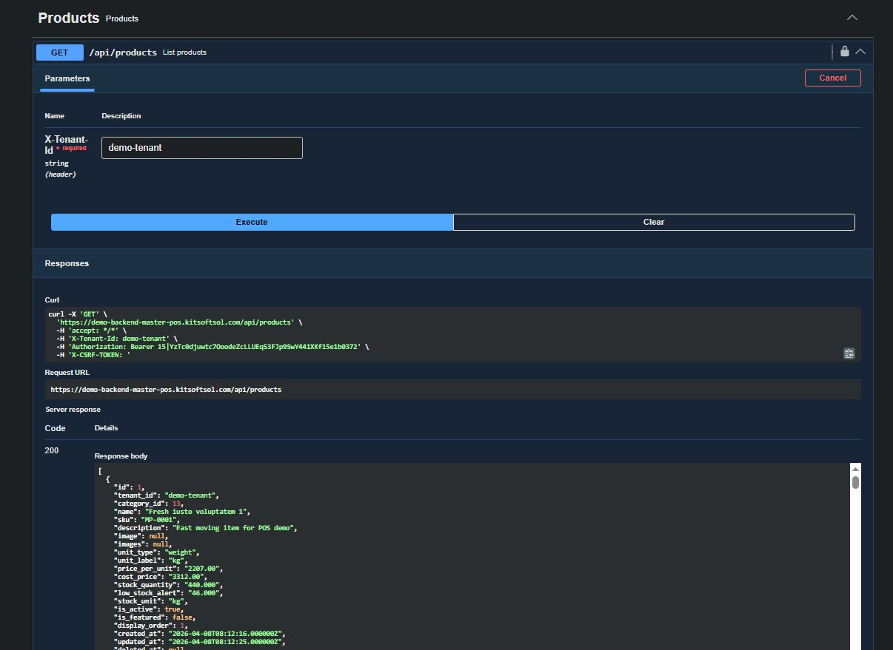

---

### Product Create — Plan Limit Validation
`POST /api/products` — Returns `HTTP 422` when free plan product limit (100) is exceeded.

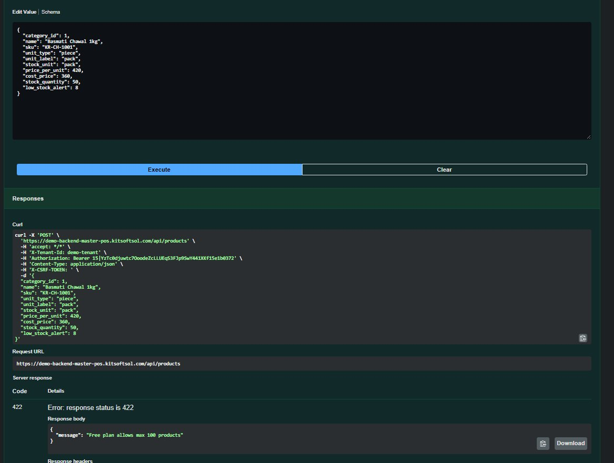

---

### Inventory List API
`GET /api/inventory` — Returns all products with live stock quantities and units.

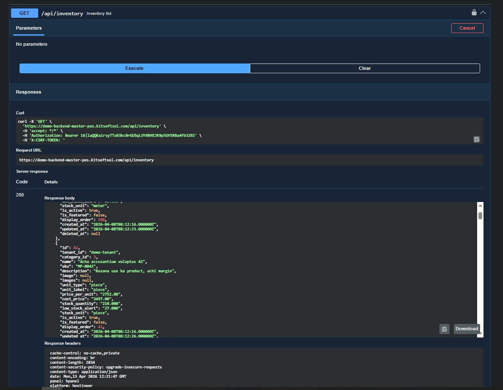

---

## 🏗 Architecture

```
┌─────────────────────────────────────────────────────────┐
│                    Vue.js Frontend                       │
│  Login │ Dashboard │ POS Board │ Products │ Reports ...  │
└───────────────────────┬─────────────────────────────────┘
                        │  HTTPS / JSON API
                        │  Authorization: Bearer {token}
                        │  X-Tenant-Id: {tenant_slug}
┌───────────────────────▼─────────────────────────────────┐
│                 Laravel API Backend                      │
│                                                          │
│  Middleware Pipeline:                                    │
│  throttle:api → tenant.identify → auth:sanctum →        │
│  tenant.user → subscription                              │
│                                                          │
│  Controllers: Auth, Dashboard, Categories, Products,     │
│               Inventory, Sales, Customers, Users,        │
│               Reports                                    │
└───────────────────────┬─────────────────────────────────┘
                        │
┌───────────────────────▼─────────────────────────────────┐
│                    MySQL Database                        │
│         (All data scoped per X-Tenant-Id)                │
└─────────────────────────────────────────────────────────┘
```

---

## 🔐 Multi-Tenancy

The system uses **header-based multi-tenancy**. Every API request must include:

```http
X-Tenant-Id: your-tenant-slug
```

This header resolves the correct tenant context before any authentication or business logic runs, ensuring complete data isolation between businesses.

---

## 📖 API Reference

**Base URL:** `https://demo-backend-master-pos.kitsoftsol.com/api`

All protected endpoints require:
```http
Authorization: Bearer {token}
X-Tenant-Id: {tenant_slug}
Content-Type: application/json
```

### Route Overview

```
# Public
POST   /api/auth/login                          Login (throttle:login)
POST   /api/register-tenant                     Register new tenant

# Auth
POST   /api/auth/logout                         Logout
GET    /api/auth/me                             Current user

# Dashboard & Reports
GET    /api/dashboard/stats                     KPI stats + daily chart
GET    /api/reports                             Revenue + top products + payment mix

# Categories
GET    /api/categories                          List all categories
POST   /api/categories                          Create category
PUT    /api/categories/{id}                     Update category
DELETE /api/categories/{id}                     Delete category

# Products
GET    /api/products                            List all products
POST   /api/products                            Create product [plan:products]
PUT    /api/products/{id}                       Update product
DELETE /api/products/{id}                       Delete product
GET    /api/products/low-stock                  Low stock products
POST   /api/products/{id}/adjust-stock          Adjust stock directly

# Inventory
GET    /api/inventory                           Inventory list with stock
POST   /api/inventory/adjust                    Stock adjustment entry
GET    /api/inventory/history                   Adjustment history log

# Sales
GET    /api/sales                               Sales history (filterable)
POST   /api/sales                               Complete a sale
GET    /api/sales/{id}                          Sale detail / invoice
POST   /api/sales/{id}/cancel                   Cancel a sale
GET    /api/sales/daily-report                  Daily sales report
GET    /api/sales/monthly-report                Monthly sales report

# Customers
GET    /api/customers                           Customer list
POST   /api/customers                           Create customer
PUT    /api/customers/{id}                      Update customer
DELETE /api/customers/{id}                      Delete customer
GET    /api/customers/{id}/purchase-history     Customer purchase history

# Users (Admin only)
GET    /api/users                               Staff list
POST   /api/users                               Add staff [plan:users]
PUT    /api/users/{id}                          Update user / role
DELETE /api/users/{id}                          Remove user
```

### Login

```bash
curl -X POST https://demo-backend-master-pos.kitsoftsol.com/api/auth/login \
  -H "X-Tenant-Id: demo-tenant" \
  -H "Content-Type: application/json" \
  -d '{ "email": "demo@masterpos.com", "password": "demo1234" }'
```

**Response:**
```json
{
  "user": {
    "id": 1,
    "tenant_id": "demo-tenant",
    "name": "Demo Owner",
    "email": "demo@masterpos.com",
    "role": "admin",
    "is_active": true
  },
  "token": "15|YzTc0djuwtc7OoodeZcLLUEqS3FJp9SwY441XKf15e1b0372"
}
```

### Create a Sale

```bash
curl -X POST https://demo-backend-master-pos.kitsoftsol.com/api/sales \
  -H "Authorization: Bearer {token}" \
  -H "X-Tenant-Id: demo-tenant" \
  -H "Content-Type: application/json" \
  -d '{
    "items": [{ "product_id": 1, "quantity": 2, "price": 2207 }],
    "payment_method": "cash",
    "discount": 0,
    "received": 5000
  }'
```

### Stock Adjustment

```bash
curl -X POST https://demo-backend-master-pos.kitsoftsol.com/api/inventory/adjust \
  -H "Authorization: Bearer {token}" \
  -H "X-Tenant-Id: demo-tenant" \
  -H "Content-Type: application/json" \
  -d '{
    "product_id": 1,
    "type": "purchase",
    "quantity": 100,
    "notes": "Restocked from supplier"
  }'
```

---

## 🚀 Getting Started

### Backend (Laravel)

```bash
git clone https://github.com/your-username/master-pos-backend.git
cd master-pos-backend

composer install
cp .env.example .env
php artisan key:generate
php artisan migrate --seed
php artisan serve
```

### Frontend (Vue.js)

```bash
git clone https://github.com/your-username/master-pos-frontend.git
cd master-pos-frontend

npm install
cp .env.example .env.local
# Set VITE_API_BASE_URL=http://localhost:8000/api
npm run dev
```

---

## 💳 Subscription & Plan Limits

| Feature | Free Plan | Paid Plan |
|---|---|---|
| Products | Max 100 | Unlimited |
| Staff Users | Limited | Unlimited |
| Sales History | Full | Full |
| Reports | Full | Full |

Plan limits are enforced at the API middleware level (`tenant.plan`). Exceeding a limit returns `HTTP 422`:

```json
{ "message": "Free plan allows max 100 products" }
```

---

## ⚠️ Error Handling

| Code | Meaning |
|---|---|
| `200` | Success |
| `401` | Unauthenticated — invalid or missing token |
| `403` | Forbidden — insufficient role/permissions |
| `404` | Resource not found |
| `422` | Validation error or plan limit exceeded |
| `429` | Too Many Requests — rate limit hit |
| `500` | Server error |

---

## 📁 Repository Structure

```
master-pos/
├── README.md
└── screenshots/
    ├── login.png
    ├── dashboard.png
    ├── pos_board.png
    ├── products.png
    ├── add_product.png
    ├── categories.png
    ├── edit_category.png
    ├── inventory.png
    ├── sales_history.png
    ├── reports.png
    ├── swagger/
    │   ├── login_request.png
    │   ├── login_response.png
    │   ├── dashboard_stats.png
    │   ├── categories_listing.png
    │   ├── products_listing.png
    │   ├── product_create_validation.png
    │   └── inventory_get.png
    └── postman/
        ├── login_request.png
        ├── login_response.png
        ├── dashboard_stats.png
        ├── categories_listing.png
        ├── products_listing.png
        ├── product_create_validation.png
        └── inventory_get.png
```

---

## 📞 Contact

Built by **KitSoft Solutions** — [kitsoftsol.com](https://kitsoftsol.com)

Feel free to reach out for custom POS solutions, white-label licensing, or freelance inquiries.

---

<div align="center">
⭐ If you find this project useful, please star it!
</div>
